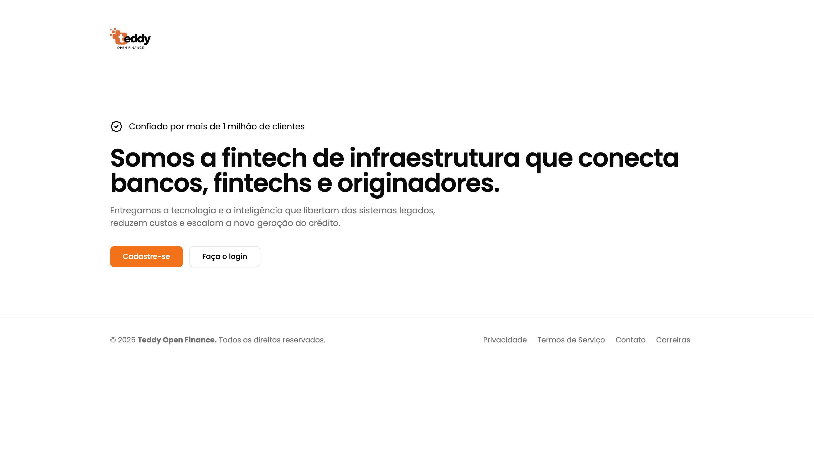
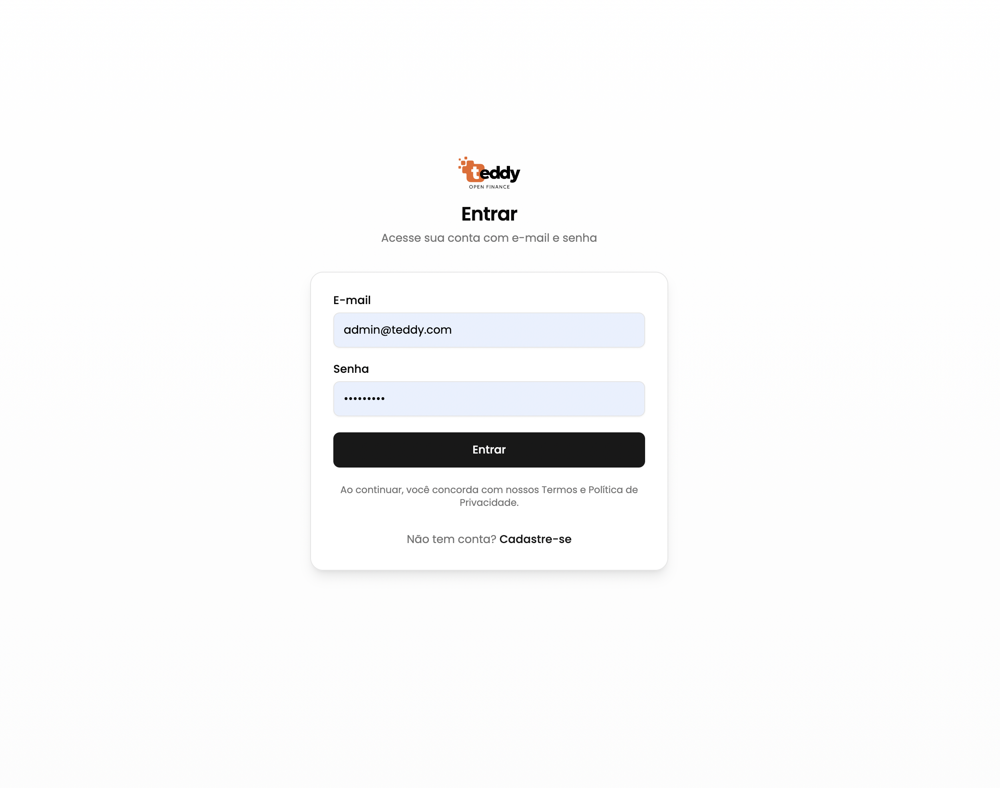
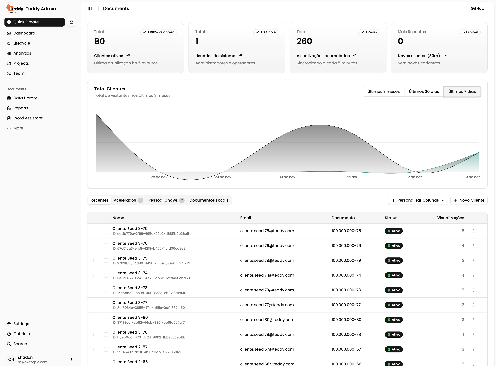

# Teddy Challenge MVP NX + NestJS + React (Vite): API Financeira Escalável & Dashboard Admin


<div align="center">
  <video controls src="./presentation/demo.mp4" width="700"></video>
</div>

> Desafio prático de MVP com Nest + React, pronto para produção e resiliente sob carga exige priorização brutal. Este documento consolida decisões arquiteturais, a disciplina de CI/CD e a escalabilidade mais sensível para que cada novo colaborador entenda **por que** de cada decisão de forma coesa.

## 🚧 Dificuldades

> O setup inicial do projeto foi bem mais complicado do que o esperado, cortesia do Nx. Tive uma baita dor de cabeça. A raiz do problema foi a falta de suporte nativo ao SWC como compilador via @nx/nest issue aberto desde 2023! O nx.dev está sendo bem criticado por vários pontos. Tentei uma alternativa complexa, customizando com @nx/js e comandos customizados para usar o SWC, mas a solução ficou instável e a integração simplesmente não rodou de forma satisfatória.

> No fim..... A solução surgiu em um vídeo recente (cerca de um mês atrás) do próprio canal do Nx no YouTube, onde abordavam problemas de workspace similares. Descobri o novo argumento workspaces=false, que foi crucial. Essa flag desativa o comportamento padrão de vinculação de referência de projetos do Nx, forçando o uso dos aliases de caminho padrão do TypeScript. Com isso, o setup finalmente se estabilizou. Consegui parar de 'queimar tempo' com configuração e passei a focar, de fato, na implementação do projeto.

## 🔍 Visão Geral & Decisões-Chave

- **Objetivo:** Implementar um serviço de contas de clientes seguro, escalável e observável, com contador de visualizações assíncrono e eficiente que abastece o Dashboard Admin.
- **Stakeholders:** Growth (iterações rápidas), Compliance (armazenamento auditável), SRE (estabilidade em picos). As decisões abaixo equilibram essas prioridades frequentemente conflitantes.
- **Princípios:** Zero-trust para tráfego de entrada, escalar horizontalmente antes de otimizar prematuramente, e medir o raio de impacto de cada mudança.

**Topologia do Monorepo (Nx)**

```
backend/
  account-service  (NestJS + TypeORM + Redis) 1# Micro-Service
frontend/
  admin            (React + Vite + shadcn/ui) 1# Micro-Frontend
  shared
    api-services   API Services (Axios)
	  auth           @teddy/auth (Context + Hooks Actions)
	  utils          (helpers)
```

> 📌 **Memorando de decisão:** Mantive tudo em um único workspace Nx para aproveitar o grafo inteligente do `nx affected` e garantir lint/config compartilhados. Consequência: quem contribui precisa dominar os comandos Nx antes de tocar rotas de produção.

## ☁️ Arquitetura de Produção: Escalabilidade & Resiliência (AWS)
****

O stack privilegia serviços gerenciados para reduzir a superfície operacional. Cada componente foi escolhido por oferecer ganchos de autoscaling, observabilidade nativa e integrações IAM com privilégio mínimo, usando AWS como referência principal.

> 🤝 **Playground-friendly:** A arquitetura fica confortável em qualquer nuvem moderna. AWS ECS/Fargate, RDS e ElastiCache encaixam perfeitamente aqui, mas é totalmente viável trocar por DigitalOcean App Platform (com deploy direto do Docker registry), Azure Container Apps/Database for PostgreSQL ou equivalentes no GCP sem reescrever o core. O importante é manter os mesmos contratos de rede, cache e build.

## ⚙️ Estratégia CI/CD: A Cadeia de Dependências

> 💡 **Performance otimizada:** Todos os passos de CI utilizam `nx affected` para garantir que somente os projetos realmente impactados (FE ou BE) sejam testados e construídos, reduzindo custo e tempo de pipeline.

1. **CI Backend (`ci-backend.yml`):** Executa lint, testes unitários e build de produção do `account-service`. Falha rápido em divergência de tipos ou schemas antes de gerar artefatos.
2. **Evento de Disparo:** Merge bem-sucedido no `main` aciona um `workflow_dispatch` para os fluxos de CD usando um PAT escopado em GitHub Secrets, isolando privilégios de deploy dos autores de PR.
3. **CD Backend (`cd-backend.yml`):** Faz login no registry, builda a imagem NestJS, etiqueta com o SHA e publica. Task definitions do ECS são atualizadas de forma atômica para evitar rollout parcial.
4. **CD Frontend (`cd-frontend.yml`):** Envia o repositório para a Vercel, que realiza o build remoto, e promove a versão assim que a invalidação do CDN é concluída.

## 📈 Deep Dive de Escalabilidade: Contador de Visualizações Assíncrono

**Problema:** O protótipo inicial executava `UPDATE clients SET view_count = view_count + 1` a cada leitura. Sob tráfego bursty isso gerava contenção de locks, inchaço transacional e retropressão em gravações não relacionadas.

**Solução:**

1. **Caminho de Leitura:** `GET /clients/:id` realiza o lookup padrão no banco e depois executa um `INCR` atômico no Redis (`client:{id}:view_count`). Mantém latência sub-milisegundo e escala linearmente com Redis shardado, se necessário.
2. **Caminho de Escrita:** Um job agendado em NestJS (`@nestjs/schedule`) roda a cada 5 minutos (development mode 10sec...), usa `redisClient.getdel(key)` para buscar e zerar cada contador de forma atômica, e envia lotes `UPDATE clients SET view_count = view_count + :delta WHERE id = :id` em uma única transação PostgreSQL.
3. **Observabilidade:** Prometheus coleta profundidade da fila (chaves pendentes) e duração do job para alertar se o flush ameaçar perder a janela.

> **Análise de Trade-off:** A solução prioriza **performance de leitura** e consistência eventual (o banco pode atrasar até 5 minutos em relação ao cache) em vez de consistência imediata — aceitável para uma métrica de visualizações.

**Resultado:** A pressão de escrita no banco vira pulsos previsíveis, o Redis absorve o hot path e o rastreamento de `view_count` escala de forma independente do CRUD principal.

## </> How to Run on Docker

Node Version
```
24.11.1
```
Create a .env file on ./backend/account-service
```
./backend/account-service/.env
```
Backend - Account Service + Postgres + Redis
```
docker compose -f ./backend/account-service/docker-compose.yml up -d --build
```
Backend Seeds - Create Initial Users and Clients to Compose Dashboard
```
nx seeds account-service
```
Frontend - Admin UI
```
docker compose -f ./frontend/admin/docker-compose.yml up -d --build
```

## Checklist requirements

- ✅ Funcionalidades
- ✅ Arquitetura
- ✅ Robustez
- ✅ Design
- ✅ Tools 
- ✅ CI/CD
- ❌ Testes Únitarios e E2E
- ⚠️ Observabilidade Partial

<br/>
<br/>




Thanks! ❤️
@mmarinhomac